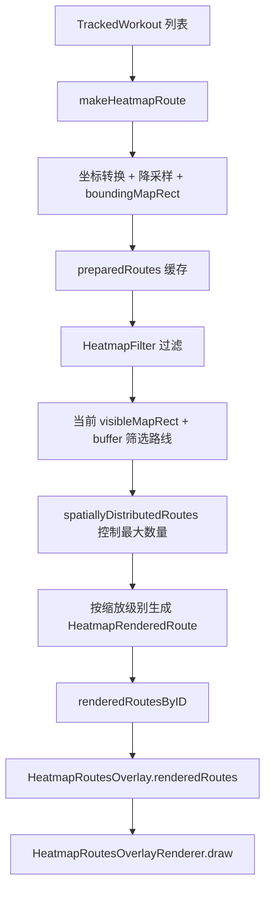

# Route Heatmap Performance Design

## 背景

路线热图页面需要把大量运动轨迹叠加到同一张地图上。产品目标是让用户快速看到自己去过哪些地方，以及哪些路线被反复经过。

这个页面天然有两个性能压力：

- 数据量大：每条运动轨迹都有大量 GPS 点，全部叠加后点数增长很快。
- MapKit overlay 成本高：如果每条轨迹都是一个 `MKPolyline` overlay，地图拖动和缩放时 MapKit 需要调度大量 renderer。

因此热图的优化目标不是“把所有原始点完整绘制出来”，而是在视觉正确和交互顺滑之间取平衡：

- 保留路线大致形态。
- 保留透明叠加后变深的热图语义。
- 地图拖动、缩放、push 进入页面时尽量不阻塞主线程。

## 演进阶段

### 阶段 1：全量轨迹一次性绘制

最初方案是进入热图页后，把所有符合条件的轨迹转换成 `MKPolyline`，然后一次性 `addOverlays`。

优点：

- 实现简单。
- 轨迹语义最直接。
- 透明叠加天然成立。

问题：

- push 进入页面时需要瞬间创建大量 `MKPolyline` 和 renderer，容易掉帧。
- 地图滑动时 MapKit 需要管理大量 overlay，拖动不跟手。
- 轨迹越多，性能退化越明显。

### 阶段 2：预处理降采样

对每条路线先做点位抽样：

- 每条轨迹只取一部分点。
- 单条路线设置最大点数上限。
- 坐标统一提前完成火星坐标转换。

对应代码：

- `WorkoutRouteHeatmapViewController.makeHeatmapRoute(...)`
- `HeatmapRoute`

优点：

- 降低每条 polyline 的绘制成本。
- 坐标转换不再发生在绘制阶段。

问题：

- overlay 数量没有减少。
- push 进入时仍可能一次性创建大量 overlay。

### 阶段 3：视口驱动加载

热图不再一次性挂载所有路线，而是根据当前地图视口决定需要绘制哪些路线。

核心策略：

- 只加载 `visibleMapRect` 附近的路线。
- 给可见区域增加 buffer，避免用户轻微拖动时马上缺线。
- 地图移动和缩放结束后，再重新计算当前视口需要的路线。
- 视口外的路线从渲染集合里移除。

对应代码：

- `routeLoadingMapRect()`
- `updateVisibleRouteOverlays()`
- `spatiallyDistributedRoutes(...)`

优点：

- 首屏需要绘制的路线数量明显下降。
- 地图移动后只更新当前区域。

问题：

- 如果当前区域路线仍然很多，MapKit overlay 调度压力依旧存在。

### 阶段 4：缩放级别动态精度

不同缩放级别下，用户对轨迹精度的感知不同：

- 远距离看全局热图时，不需要完整点位。
- 放大到局部区域时，需要更细的路线形态。

因此按照地图经度跨度动态调整点数：

- 远景：更低点数。
- 中景：中等点数。
- 近景：接近完整热图点数。

对应代码：

- `overlayPointLimitForCurrentZoom()`
- `coordinates(for:maximumCount:)`

优点：

- 缩小时减少绘制压力。
- 放大后恢复更精细的路线。

问题：

- 如果直接清空旧线再绘制新线，会出现明显闪烁。

### 阶段 5：避免缩放闪烁

缩放导致精度变化时，旧方案会先移除旧 overlay，再添加新 overlay，因此轨迹线会短暂消失。

优化策略：

- 已经上屏的路线不因为缩放立即清空。
- 新精度数据准备好后先发布新数据。
- 再从渲染集合里移除已经不需要的旧数据。

当前实现已经不再依赖大量 `MKPolyline`，所以闪烁问题主要通过统一 renderer 的数据发布来规避。

### 阶段 6：单 Overlay 自定义 Renderer

这是当前主要性能优化点。

之前即便做了视口加载，地图上仍然可能有几百个 `MKPolyline` overlay。MapKit 在拖动和缩放时需要对每个 overlay 做调度，导致“不跟手”。

当前方案改为：

- 地图上只添加一个 `HeatmapRoutesOverlay`。
- `HeatmapRoutesOverlay` 内部持有当前需要绘制的路线集合。
- `HeatmapRoutesOverlayRenderer` 在一个 renderer 里统一绘制所有当前可见路线。

对应代码：

- `HeatmapRenderedRoute`
- `HeatmapRoutesOverlay`
- `HeatmapRoutesOverlayRenderer`
- `WorkoutRouteHeatmapViewController.publishRenderedRoutes()`

优点：

- MapKit 侧只需要管理一个路线 overlay。
- 地图拖动时 overlay/renderer 调度成本大幅下降。
- 仍然可以逐条路线用透明黑色 stroke 绘制，所以重叠区域会更深。

## 当前数据流

## 关键设计点

### 1. 路线预处理和渲染数据分离

`HeatmapRoute` 是热图路线的基础数据：

- route id
- display coordinates
- bounding map rect
- activity type

`HeatmapRenderedRoute` 是当前缩放级别下真正拿来绘制的数据：

- route id
- 当前精度下的 coordinates
- bounding map rect
- point limit

这样可以让基础路线缓存长期存在，而当前绘制数据根据视口和缩放级别快速替换。

### 2. 视口外路线不参与绘制

每次地图区域变化后，只处理当前可见区域附近的路线。

这里没有只使用严格的 `visibleMapRect`，而是加了 buffer：

- 减少轻微拖动时路线突然出现/消失。
- 给用户下一次拖动留出一点预加载区域。

### 3. 空间分布抽样

如果当前视口内路线数量仍然过多，不直接取前 N 条，而是按网格做空间分布抽样。

这样可以避免所有路线都集中在某个局部区域，导致热图视觉上不均衡。

对应方法：

- `spatiallyDistributedRoutes(...)`

### 4. 单 renderer 内部逐条绘制

`HeatmapRoutesOverlayRenderer` 会遍历当前路线集合，每条路线单独 stroke。

这点很重要，因为热图需要“重叠越多越深”的效果。如果把所有路线预合成一个完全不透明路径，热图语义会丢失。

当前 renderer 使用：

- 黑色
- alpha 透明度
- round line cap
- round line join

因此多条路线重复经过同一区域时，视觉上会自然叠深。

## 当前取舍

### 保留的能力

- 透明叠加热图效果。
- 按运动类型过滤。
- 地图缩放后路线精度动态调整。
- 大量轨迹下更顺滑的地图拖动。
- 火星坐标转换仍在数据准备阶段完成。

### 接受的近似

- 热图不是完整原始 GPS 点级别绘制。
- 远景下路线会更简化。
- 当前视口外路线不会立刻绘制。
- 路线数量极大时，会按空间分布抽样，而不是全部显示。

这些近似符合热图目标：用户需要知道大概去过哪些区域和路线，而不是在热图页检查每个 GPS 点。

## 后续可继续优化方向

### 1. 瓦片化路线渲染

如果未来路线数量继续增长，可以把路线预渲染成 tile：

- 按地图 zoom/x/y 分块。
- 每个 tile 只绘制落在该 tile 内的路线片段。
- 类似自定义 `MKTileOverlay`。

优点是极限性能最好，缺点是实现复杂度明显上升，而且需要更复杂的缓存失效策略。

### 2. 后台预计算热图区块

可以在 app 空闲时提前计算：

- 每条路线的简化版本。
- route bounding rect index。
- 不同 zoom level 的抽样结果。

这样进入热图页时只做很轻的视口筛选。

### 3. 更精细的空间索引

当前视口路线筛选是线性遍历 `visibleRoutes`。

如果路线数量非常大，可以引入空间索引：

- grid index
- quadtree
- R-tree

这样视口查询可以从 O(n) 降到接近 O(log n + k)。

### 4. 渲染节流

当前地图区域变化后会 debounce 再更新。后续可以进一步区分：

- 用户正在拖动：只保留已有路线，不重算。
- 用户停止拖动：更新当前视口路线。
- 用户快速缩放：延迟到最终 zoom 再切精度。

这样可以继续减少手势过程中的主线程压力。

## 当前结论

当前方案的核心思想是：

> 数据层保留足够路线信息，显示层只渲染当前用户看得到、当前缩放级别需要的路线，并且把 MapKit overlay 数量压到最低。

这比一次性全量 `MKPolyline` 更适合路线热图这种高轨迹数量场景，也为后续瓦片化、空间索引和后台预计算留下了继续演进的空间。
